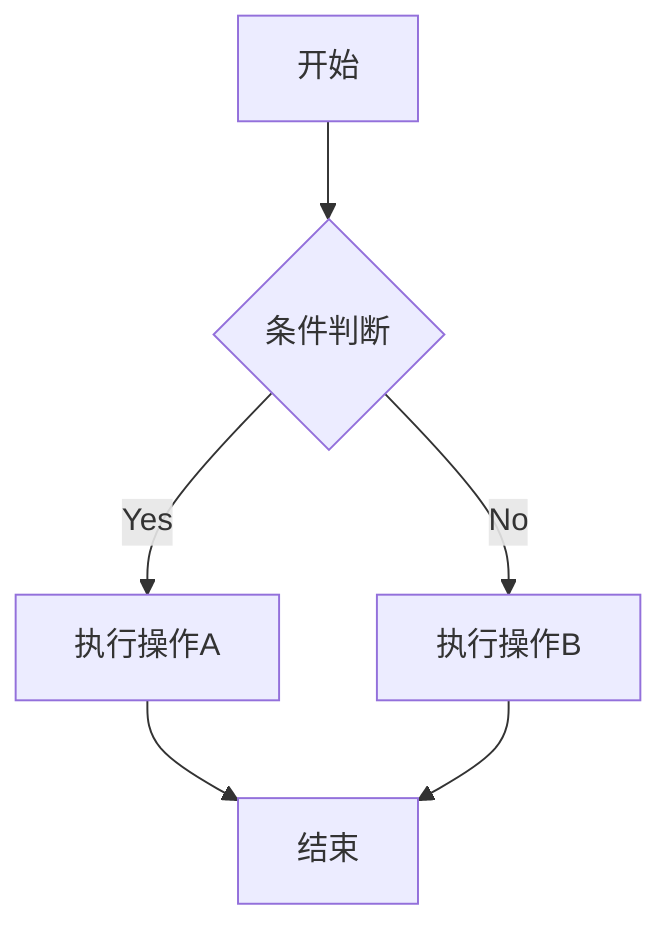

# 中通物流开放平台对接说明文档

## 版本记录

| 版本号 | 修订日期   | 修订人 | 修订说明         |
|--------|------------|--------|------------------|
| v1.0   | 2025-08-10 | `杨工`   | 初稿             |
| v1.1   | 2023-09-15 | ``使用 `反引号` 包围代码``   | 新增订阅接口说明 |
| v1.2   | 2023-09-20 | 王工   | 完善签名示例     |

## 1. 文档概述

### 1.1 对接目的

实现业务系统与中通开放平台（<https://open.zto.com）的深度集成，主要目标包括：>

- 自动化下单及电子面单获取
- 实时物流轨迹查询与订阅
- 运费计算与时效预测
- 异常件智能监控
- 物流数据统计分析

### 1.2 适用场景

- **电商订单履约**：自动创建物流订单并获取运单号
- **仓储系统对接**：WMS系统批量获取电子面单
- **物流看板**：实时监控全网物流状态
- **运费对账**：自动化运费计算与核对
- **服务评价**：物流服务质量分析

### 1.3 对接模式

